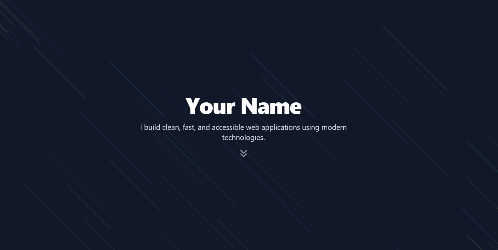
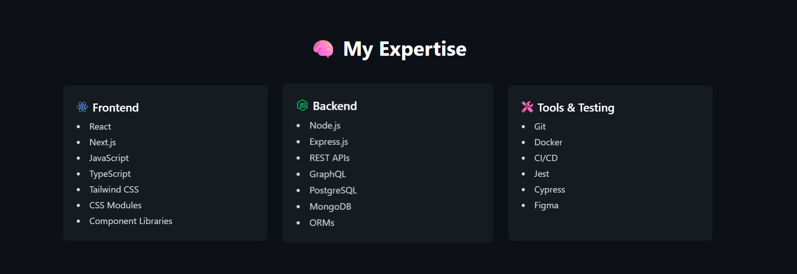
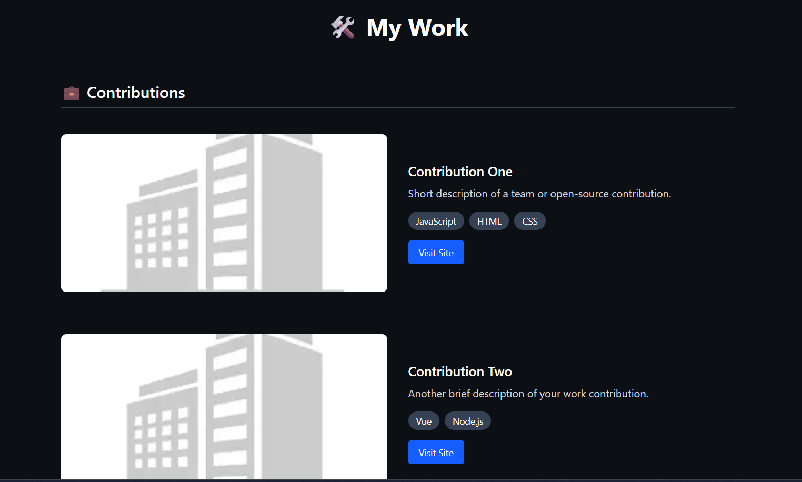
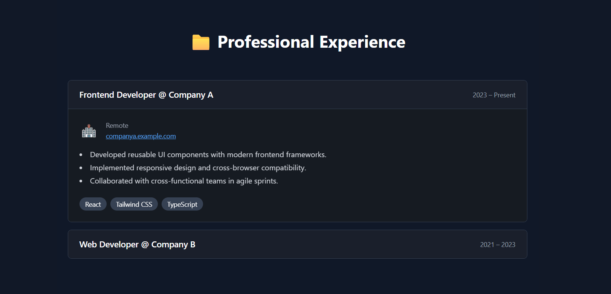
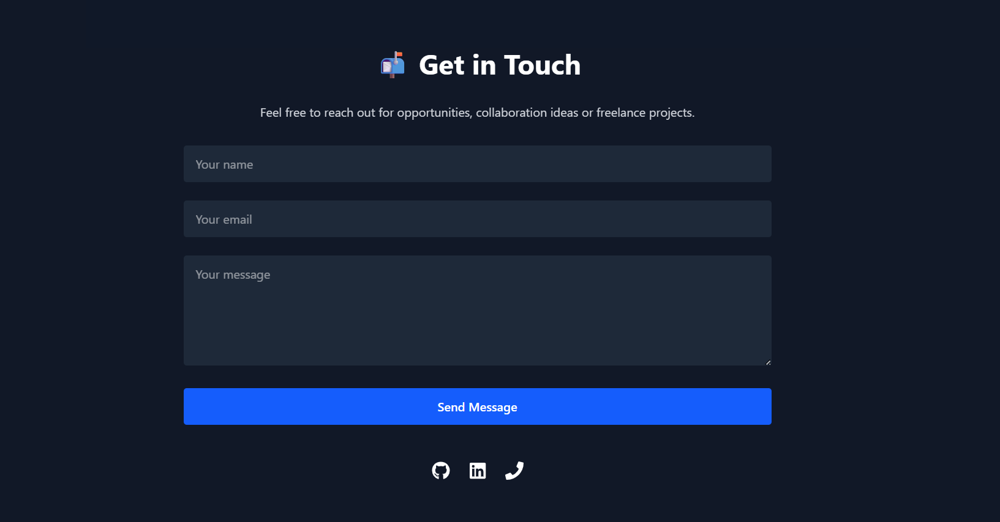

# 🌐 Developer Portfolio Template (React + Next.js + Tailwind)

A modern, responsive, and customizable developer portfolio template built with **Next.js 14 App Router**, **Tailwind CSS**, and **Framer Motion** — perfect for showcasing your skills, projects, and professional experience.

## ✨ Features

- Built with Next.js 14 App Router
- Tailwind CSS for styling
- Framer Motion for subtle animations
- Responsive layout with dark mode
- Fully customizable via `siteConfig.ts`
- Pre-built sections: Hero, Skills, Projects, Experience, Contact
- Easily deployable to Vercel

---

## 🚀 Getting Started

### 1. Clone the Repository

```bash
git clone https://github.com/takoalania/dev-portfolio-starter
cd portfolio-template
```

### 2. Install Dependencies

```bash
npm install
# or
yarn
```

### 3. Start the Development Server

```bash
npm run dev
# or
yarn dev
```

Open [http://localhost:3000](http://localhost:3000) to view it in the browser.

---

## 🛠 Configuration

Edit `src/config.ts` to personalize the template.

### 🔹 Basic Info

```ts
name: "Your Name",
title: "Frontend Developer",
bio: "I build fast, accessible, and modern web apps.",
email: "you@example.com",
github: "https://github.com/yourusername",
linkedin: "https://linkedin.com/in/yourusername",
resumeUrl: "/resume.pdf",
```

### 🔹 Projects

```ts
projects: [
  {
    title: "My App",
    description: "Short description...",
    image: "/projects/app.png",
    tech: ["React", "Tailwind"],
    liveUrl: "https://example.com",
    codeUrl: "https://github.com",
    category: "personal",
  }
]
```

### 🔹 Experience

```ts
experience: [
  {
    company: "Company Name",
    title: "Frontend Developer",
    location: "Remote",
    period: "2023 – Present",
    logo: "/logos/logo.png",
    website: "https://company.com",
    description: [ "Task 1", "Task 2" ],
    tech: ["React", "TypeScript"]
  }
]
```

### 🔹 Skills

```ts
skills: [
  {
    category: "Frontend",
    icon: "react",
    items: ["React", "Next.js", "TypeScript"]
  },
  ...
]
```

---

## 🖼️ Assets

Logos and project images go in:

```
public/
├── logos/
├── projects/
```

Use your own logos or leave them blank.

---

## 📸 Screenshots

### Hero Section


### Skills Section


### Projects Section


### Experience Section


### Contact Section


## 📦 Deployment

We recommend [Vercel](https://vercel.com):

1. Push your repo to GitHub
2. Connect your repo to Vercel
3. Done ✅

---

## 📄 License

This project is licensed under the **MIT License** — free to use, modify, and distribute.

---

## 🙌 Credits

Created by Tamar Alania – built as a professional template to help devs showcase their work with zero friction.